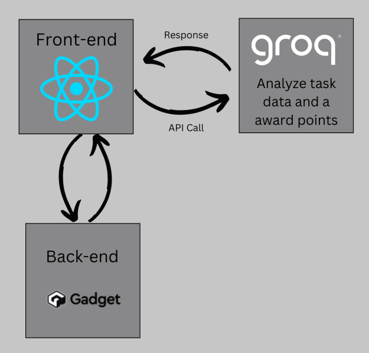

# Skill-Issue: 
## Level Up Your Life, One Task at a Time

Skill-Issue is a next-generation productivity tool designed to help users overcome their "skill issues" and level up in life. Built around the simplicity of a traditional to-do list, Skill-Issue leverages the power of Groq's advanced artificial intelligence to transform tasks into skill experience points. Users choose five pillars (key focus areas of life), and Skill-Issue intelligently assigns experience points to these pillars based on the tasks completed. 

The platform also includes a dynamic stats page, allowing users to track their progress across all their skills and maintain a balance between their focus areas. With Skill-Issue, managing tasks becomes a fun and engaging way to grow your real-world skills and achieve your goals.

## Stack

### Skill Conversion with AI
Skill-Issue seamlessly integrates Groq's artificial intelligence to analyze tasks and intelligently assign experience points to the appropriate skills within the user's chosen five pillars. By doing so, Skill-Issue ensures that every completed task contributes meaningfully to personal growth. Whether the task is related to fitness, creativity, learning, or professional goals, the AI ensures that the effort is translated into tangible progress.

### Track Your Progress
The **Stats Page** provides users with an overview of their skill development journey. It displays progress across all five pillars, highlighting which skills have seen the most growth and which ones may need more attention. The intuitive visualizations help users stay motivated and maintain a healthy balance between their focus areas, ensuring holistic personal development.

## Disclaimer
Skill-Issue is a proof-of-concept application developed during a hackathon. It is intended for demonstration purposes and should not be relied upon as a substitute for professional planning or development tools.
